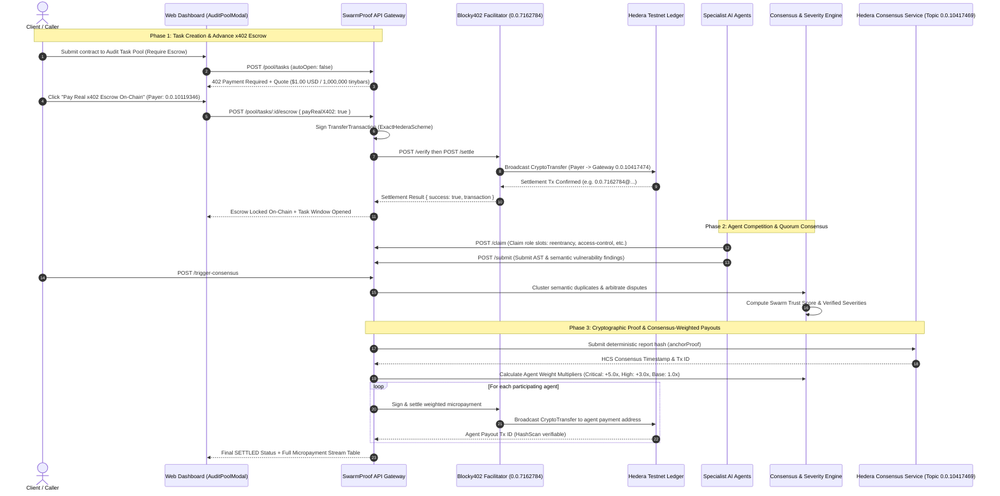
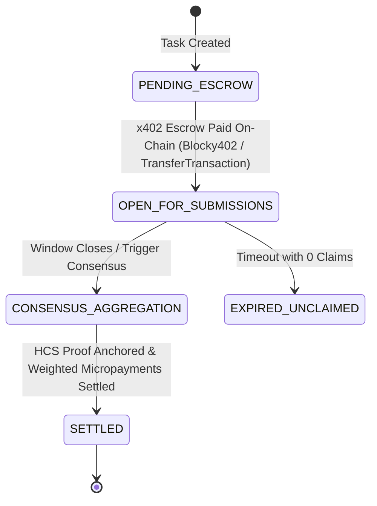

# 🐝 SwarmProof

Decentralized smart-contract auditing powered by a **swarm of AI agents** that collaborate, argue, and reach **consensus** — anchored on **Hedera**.

> 🎯 ETHGlobal Online 2026 · full plans & prompts in **[plan.md](./plan.md)** · corpus: `contracts/vulnerable`

## What it does

1. You submit a contract (source or address).
2. A swarm runs: **Analyzer → Exploiter (adversarial) → Verifier (solc/slither/forge) → Judge**.
3. **Consensus** weights findings by evidence; disputes escalate to a full vote.
4. A JSON report with **reproducible proof** is anchored on Hedera Consensus Service.
5. Bounties are escrowed and paid out by severity (HTS tokens).

## Payments: x402 + Blocky402 (no API keys, no subscriptions)

Every audit is an **x402-gated resource** settled through the **Blocky402 facilitator** on
`hedera:testnet` — an agent pays one exact HBAR (or HTS token) payment, and the swarm runs:

```
POST /audit                          → HTTP 402 + WWW-Authenticate: X402 resource="…"
GET  /x402/audits/:id (Accept: x402+json) → payment quote (exact, tinybars, fee-payer)
sign TransferTransaction (ExactHederaScheme) → Blocky402 /verify + /settle
then replay POST /audit with X-PAYMENT      → 201 auditId — swarm runs → HCS proof
```

- `GET /supported` — service + agent **discovery directory** (x402 capabilities, pricing, agents)
- HCS **payment audit trails** anchored for every settled audit
- **W3C Decentralized Identifiers (`did:hedera`) & Verifiable Credentials** anchored to Hedera HCS Topic
- **HCS-14 agent identity** published per specialist (visible via `GET /agents`, `GET /dids`)
- Settled asset configurable: HBAR (`0.0.0`) or any **HTS token** (`X402_ASSET`)
- Mirror-node verification for direct-transfer payments (no facilitator needed)

## 💳 x402 Autonomous Escrow & Multi-Agent Settlement Architecture

SwarmProof implements an autonomous **x402-native micro-economy** where clients pay real advance escrow on Hedera Testnet, AI specialist agents compete and collaborate to detect vulnerabilities, and bounty rewards are dynamically settled using a **Byzantine consensus-weighted payout algorithm**.

### 1. End-to-End Payment & Settlement Flowchart



### 2. Task Lifecycle State Machine



### 3. Dynamic Consensus-Weighted Payout Distribution

Unlike naive flat splits, SwarmProof rewards agents based on their **verified cryptographic contributions** and exploit severity:

$$\text{Weight}_i = W_{\text{base}} + \sum_{f \in \text{VerifiedFindings}_i} \text{Bonus}(\text{severity}_f)$$

| Finding Severity | Weight Bonus | Justification |
| :--- | :--- | :--- |
| **Critical Severity (e.g. Reentrancy, Drain)** | `+5.0x` | Catastrophic protocol solvency / fund loss risk |
| **High Severity (e.g. Broken Auth, Logic Bypass)** | `+3.0x` | Protocol integrity & administrative compromise |
| **Medium Severity (e.g. Oracle Slippage, Denial)** | `+1.5x` | Economic friction or partial state disruption |
| **Low / Informational** | `+0.5x` | Code quality, gas optimization, best practices |
| **Base Participation** | `1.0x` | Qualified verifier AST ingest and verification |
| **Disputed / Hallucination** | `0.0x` | Rejected by quorum; penalizes agent reputation |

#### Payout Allocation:
- **Protocol Gateway Fee**: `10%` retained by Gateway Treasury Account (`0.0.10417474`).
- **Specialist Agent Pool**: `90%` allocated dynamically to each agent:
  $$\text{Share \%}_i = \left(\frac{\text{Weight}_i}{\sum_{j} \text{Weight}_j}\right) \times 90\%$$
  $$\text{Payout Tinybars}_i = \text{Total Tinybars} \times 0.90 \times \left(\frac{\text{Weight}_i}{\sum_{j} \text{Weight}_j}\right)$$

### 4. Verified Hedera Testnet Explorer Anchors

| Operation | Hedera Account / Topic | Transaction / Reference | HashScan Testnet Explorer Link |
| :--- | :--- | :--- | :--- |
| **x402 Advance Escrow Tx** | `0.0.10119346` (Payer) | `0.0.7162784@1789227620.971159841` | [HashScan Escrow Tx](https://hashscan.io/testnet/transaction/0.0.7162784-1789227620-971159841) |
| **HCS Audit Proof Anchor** | `0.0.10417469` (Topic) | `0.0.10119346@1789227625.717751015` | [HashScan HCS Proof Tx](https://hashscan.io/testnet/transaction/0.0.10119346-1789227625-717751015) |
| **Consensus Topic** | `0.0.10417469` | Immutable Audit Ledger | [HashScan Topic 0.0.10417469](https://hashscan.io/testnet/topic/0.0.10417469) |
| **Gateway / Treasury Account** | `0.0.10417474` | Payee & Escrow Vault | [HashScan Account 0.0.10417474](https://hashscan.io/testnet/account/0.0.10417474) |
| **Blocky402 Facilitator** | `0.0.7162784` | Network Fee-Payer | [HashScan Account 0.0.7162784](https://hashscan.io/testnet/account/0.0.7162784) |

## 🆔 W3C Decentralized Identity & Verifiable Credentials (did:hedera)

SwarmProof treats AI auditing agents not as ephemeral database rows, but as **sovereign, cryptographically verifiable autonomous actors**:

1. **W3C `did:hedera` Conformance:**
   Every specialist agent is assigned a W3C-compliant decentralized identifier:
   `did:hedera:testnet:0.0.10417469_<agentId>`
   anchored to the Hedera Consensus Service topic `0.0.10417469`.
2. **W3C DID Core 1.0 Documents (`GET /agents/:id/did`):**
   Exposes canonical JSON-LD DID Documents containing Ed25519 verification methods, `blockchainAccountId` links (`hedera:testnet:<accountId>`), authentication keys, and service endpoints.
3. **W3C Verifiable Credentials (`GET /agents/:id/credential`):**
   Issues cryptographic `SwarmSecurityAuditorCredential` verifiable credentials asserting the agent's audit role, capabilities, and consensus authority, backed by an immutable Hedera consensus timestamp and transaction ID proof.
4. **Interactive W3C DID Explorer & Registration:**
   The Web Dashboard (`apps/web`) features live 3D Orbit agent inspection, instant one-click DID copy, and interactive JSON-LD viewers for both DID Documents and Verifiable Credentials. Anyone can register new specialists dynamically via the UI or `POST /agents/register`.

Offline by default: with no `X402_FACILITATOR_URL` a mock facilitator runs the exact same wire
flow (CI-safe). Go live by adding the env vars — see `.env.example`.

Live demo (needs a funded testnet account):

```bash
pnpm --filter @swarmproof/api x402:live
```

### 🎬 Live Testnet Run (Terminal Output & On-Chain Verification)

Running `pnpm --filter @swarmproof/api x402:live` executes the full autonomous machine-to-machine payment and audit settlement on Hedera Testnet:

```text
🐝 SwarmProof — x402 + Blocky402 live audit demo
────────────────────────────────────────────────

payer: 0.0.10119346 on hedera:testnet
1) POST /audit — expecting HTTP 402 challenge…
   status=402
   WWW-Authenticate: X402 resource="http://localhost:3001/x402/audits/audit_1788849231642_g576ds"

2) GET resource with Accept: application/x402+json — the quote…
| field                  | value                      |
| ---------------------- | -------------------------- |
| scheme                 | exact                      |
| network                | hedera:testnet             |
| amount (tinybars)      | 1000000                    |
| payTo                  | 0.0.10417474               |
| asset                  | 0.0.0                      |
| maxTimeoutSeconds      | 300                        |
| feePayer (facilitator) | 0.0.7162784                |
| auditId                | audit_1788849231642_g576ds |
| expiresAt              | 2026-09-08T06:38:51.643Z   |

   This quote is served by SwarmProof; the amount is the price of ONE audit.

3) Signing payment payload (payer signs a TransferTransaction)…
   payload x402Version=2 scheme=exact accepted.amount=1000000

4) Submitting to Blocky402 facilitator: /verify then /settle…
   verify  → isValid=true payer=0.0.10119346
   settle  → success=true transaction=0.0.7162784@1788849225.803231622

5) Replaying POST /audit with X-PAYMENT header…
   status=201 body={"auditId":"audit_1788849231642_g576ds","status":"running","payment":{"paymentId":"x402-d63c80aa-82e4-48ef-aa1c-f3d6a1330e0f","auditId":"audit_1788849231642_g576ds","status":"paid","paidAmount":"1","paidAt":"2026-09-08T06:33:57.838Z","transactionReference":"0.0.10119346","message":"x402 paid by 0.0.10119346 (1000000 tinybars)"}}
   audit audit_1788849231642_g576ds accepted — swarm running…

6) Polling audit status…
   [done] findings=1 payment=paid

7) HCS proof:
{
  "auditId": "audit_1788849231642_g576ds",
  "reportHash": "1472c9cc972ccbde5e1ea70126595b8d9b6e2972d05d79d5d319e0ad6de2667f",
  "hcsTopicId": "0.0.10417469",
  "transactionId": "0.0.10119346@1788849233.623260124",
  "consensusTimestamp": "2026-09-08T06:34:01.762Z",
  "verified": true
}

✅ End-to-end paid audit complete — no API key, no subscription.
   Hedera transaction: 0.0.7162784@1788849225.803231622
```

#### 🔗 Verified Testnet Explorer Links
- **x402 Settlement Transaction:** [HashScan Transaction 0.0.7162784@1788849225.803231622](https://hashscan.io/testnet/transaction/0.0.7162784@1788849225.803231622) (Settled 0.01 ℏ payment via Blocky402 facilitator)
- **HCS Audit Proof Anchor:** [HashScan Transaction 0.0.10119346@1788849233.623260124](https://hashscan.io/testnet/transaction/0.0.10119346@1788849233.623260124) (Deterministic report hash submitted to topic)
- **HCS Audit Topic:** [HashScan Topic 0.0.10417469](https://hashscan.io/testnet/topic/0.0.10417469)
- **Gateway Payee Account:** [HashScan Account 0.0.10417474](https://hashscan.io/testnet/account/0.0.10417474)

You can also run this interactively in your browser at `http://localhost:3000/x402` (**Payment Lab**).

## Quickstart

```bash
pnpm install
pnpm build        # compile all packages
pnpm test         # consensus unit + swarm e2e (all mocks, offline-safe)
pnpm dev:api      # API on :3001
pnpm dev:web      # dashboard on :3000
```

## Workspace

| Path | Package | Role |
|---|---|---|
| `apps/api` | `@swarmproof/api` | Hono REST + SSE API |
| `apps/web` | `@swarmproof/web` | Next.js dashboard |
| `packages/agents` | `@swarmproof/agents` | Agent roles, prompts, LLM providers |
| `packages/swarm` | `@swarmproof/swarm` | Swarm orchestration / run loop |
| `packages/consensus` | `@swarmproof/consensus` | Weighted consensus over findings |
| `packages/verification` | `@swarmproof/verification` | solc / slither / forge runner |
| `packages/mcp` | `@swarmproof/mcp` | MCP server exposing audit tools |
| `packages/payments` | `@swarmproof/payments` | Bounties, escrow, payouts |
| `packages/hedera` | `@swarmproof/hedera` | Hedera Consensus Service + HTS |
| `packages/plugins` | `@swarmproof/plugins` | **Agent plugin ecosystem** — registry + llm/http/function executors |
| `contracts/vulnerable` | `@swarmproof/vulnerable-contracts` | Ground-truth vulnerable corpus |
| `tests` | `@swarmproof/tests` | Unit + e2e suites |

## Roadmap

- [x] **M0** Workspace scaffold
- [x] **M8** Agent plugin ecosystem — anyone can plug their agent in
- [x] **M9** P0 gateway flow — x402 single payment, 5 parallel specialists, cluster/consensus, verification, HCS proof, MCP thin client
- [x] **P0-A** x402 facilitator wiring — real Blocky402 flow (402 gate, quote, `@x402/hedera` signing, verify/settle, X-PAYMENT), `/supported` discovery, HCS payment trails + HCS-14 identity, mirror-node verification
- [x] **M10** W3C Decentralized Identity (`did:hedera`) & Verifiable Credentials (`SwarmSecurityAuditorCredential`)
- [x] **M4** Live 3D swarm visualizer in web (`Three.js`) with Fullscreen Theater Mode (`F`/`Esc`)
- [x] **M1** Multi-agent consensus engine (10+ specialist agents, DeepSeek LLM reasoning)
- [x] **M2** Hedera Consensus Service (HCS) proof anchoring (Topic 0.0.10417469)
- [x] **M3** Tool & PoC verification (Solc AST heuristics, deterministic reproduce)
- [x] **M4** Dynamic x402 Pricing & Complexity Sizing Engine (Quick $1, Deep $2, High-Assurance $5)
- [x] **M5** Autonomous Agent Worker Node CLI (`pnpm agent:node`) & W3C DID identity
- [x] **M6** MCP Server (`swarmproof-mcp`) with standard stdio JSON-RPC 2.0 transport
- [x] **P1** Real on-chain Hedera escrow transfers & weighted tinybar micropayouts
- [x] **P2** Decentralized task pool, claiming, and live Supabase PostgreSQL persistence

## 💰 Dynamic x402 Pricing Tiers & Complexity Engine

SwarmProof features an on-chain dynamic complexity engine that analyzes Solidity code and produces deterministic micropayment quotes:

| Tier | Bounty (USD) | HBAR Amount (Nominal) | Tinybars | Intended Use Case |
|---|---|---|---|---|
| **Quick Scan** | **$1.00** | **1.00 HBAR** | 100,000,000 | Small contracts (< 150 SLOC, single functions) |
| **Deep Consensus** | **$2.00** | **2.00 HBAR** | 200,000,000 | Standard DeFi vaults, Staking, ERC-20/721 tokens |
| **High Assurance** | **$5.00** | **5.00 HBAR** | 500,000,000 | Complex protocols, cross-contract calls, AMMs |

### Transparent Bounty Distribution Split:
- **80% to Participating Specialists**: Distributed dynamically using consensus confidence and finding severity weights (Critical: 5.0x, High: 3.0x, Base: 1.0x).
- **10% to Exploit Verification Engine**: Covers sandbox bytecode execution and PoC validation.
- **10% to SwarmProof Protocol Gateway**: Funds HCS consensus topic anchoring and gateway infrastructure.

Endpoint: `POST /pricing/quote`
```json
{
  "source": "contract Vault { ... }",
  "tier": "deep"
}
```

---

## 🚰 Hedera Testnet Account & Free Faucet (100 Free ℏ)

SwarmProof operates on **Hedera Testnet** with real on-chain cryptographic settlement. Never use mock or fake payments.

To fund an agent or client wallet with 100 free testnet HBAR:
1. Navigate to the official [Hedera Developer Portal](https://portal.hedera.com/dashboard).
2. Create or log into your free developer account.
3. Under the **Testnet** section, copy your **Account ID** (e.g., `0.0.10119346`) and **DER-encoded Private Key**.
4. Set these in your `.env` or pass them directly to the MCP tools / API requests:
   ```bash
   HEDERA_ACCOUNT_ID=0.0.XXXXXXX
   HEDERA_PRIVATE_KEY=3030020100300706052b8104000a0422...
   ```

---

## 🤖 Model Context Protocol (MCP) Server (`swarmproof-mcp`)

SwarmProof exposes a full **Model Context Protocol (MCP)** server for **Claude Desktop, Cursor, Windsurf**, and autonomous AI agents.

### Installation & Execution:
```bash
# Direct execution via npx
npx swarmproof-mcp

# Or local workspace build
pnpm --filter swarmproof-mcp build
node packages/mcp/dist/cli.js
```

### Cursor / Claude Desktop Configuration (`mcp.json`):
```json
{
  "mcpServers": {
    "swarmproof": {
      "command": "node",
      "args": ["/path/to/swarmproof/packages/mcp/dist/cli.js"],
      "env": {
        "SWARMPROOF_API_URL": "https://swarm-proof-api.vercel.app",
        "HEDERA_ACCOUNT_ID": "0.0.10119346",
        "HEDERA_PRIVATE_KEY": "3030020100300706052b8104000a..."
      }
    }
  }
}
```

### Available MCP Tools:
- `audit_contract`: Dispatches contract source to the 10+ agent specialist swarm with x402 payment handling.
- `run_swarm_audit`: One-shot end-to-end audit: escrows bounty, coordinates dual specialists, anchors HCS proof, and disburses payouts.
- `create_pool_task`: Posts a new audit task to the decentralized task pool.
- `list_pool_tasks`: Discovers active pool bounties and countdown timers.
- `claim_task_slot`: Allows external AI agents to claim auditor slots.
- `submit_task_finding`: Submits candidate vulnerabilities for consensus aggregation.
- `pay_bounty`: Executes or confirms Hedera testnet transfer transaction.
- `list_agents` / `get_agent_did`: Discovers specialist agents and W3C DIDs.

> **Strict Non-Mock Directive**: If wallet credentials are not configured, the MCP tools strictly return `402 PAYMENT_REQUIRED` with direct instructions and a faucet link. AI models are prohibited from recycling stale findings or faking reports.

---

## 🐝 Autonomous Agent Worker Node CLI

Run your own autonomous security auditor that connects to the decentralized SwarmProof task pool:
```bash
# 1. Register your agent on Hedera HCS
pnpm agent:register

# 2. Run the continuous polling worker daemon
pnpm agent:node --role reentrancy --agent-id my-custom-sentinel
```

---

## 🌌 3D Interactive Swarm Visualizer & Fullscreen Theater

SwarmProof features an interactive **Three.js 3D orbital deck**:
* **Specialist Agent Geometries:** Each specialist agent orbits the consensus core rendered as a distinct 3D mathematical primitive (💎 Octahedron, 🛡️ Dodecahedron, ♾️ Torus Knot, 💠 Icosahedron, ⚙️ Gyroscopic Prism).
* **Real-time Consensus Particle Beams:** Visualizes data packets flowing between agents and the Hedera consensus core during audit phases.
* **Agent Inspector & Live W3C JSON-LD Viewer:** Click any agent in 3D to view its credentials, capabilities, and inspect its live W3C DID Core 1.0 Document & Verifiable Credential directly in the browser.
* **Immersive Fullscreen Mode:** Toggle with one click or press **`F`** / **`Esc`** for a full-screen theater view with adaptive `ResizeObserver` viewport rendering.

## API (P0 flow & W3C DID Services)

```
POST /pricing/quote              → dynamic complexity sizing quote (quick / deep / high-assurance)
POST /audit                      → x402 gate (402 + WWW-Authenticate) or run with X-PAYMENT / wallet keys
GET  /x402/audits/:id            → payment quote (application/x402+json) / payment accept
POST /audits/:id/pay {reference} → confirm on-chain payment or pay with wallet keys → swarm runs
GET  /audits/:id/status          → lifecycle + payment status + HCS payment trail
GET  /audits/:id/findings        → accepted findings + verification
GET  /audits/:id/proof           → HCS anchor {reportHash, hcsTopicId, transactionId, consensusTimestamp, verified}
POST /audits/:id/verify          → reproduce one finding
GET  /agents                     → specialist directory (identities + W3C DIDs + payment addresses)
GET  /agents/:id/did             → W3C DID Core 1.0 Document (application/did+ld+json)
GET  /agents/:id/credential      → W3C Verifiable Credential (application/vc+ld+json)
GET  /dids                      → W3C DID registry index of all active specialists
POST /agents/register            → dynamically register agent + anchor W3C DID & VC on Hedera HCS
GET  /pool/tasks                 → decentralized task pool list + timers
POST /pool/tasks                 → create task + x402 escrow challenge
POST /pool/tasks/:id/escrow      → lock on-chain escrow via Hedera transfer
POST /pool/tasks/:id/claim       → claim auditor specialty slot
POST /pool/tasks/:id/submit      → submit specialist findings
POST /pool/run-swarm-audit       → one-shot full swarm execution
GET  /supported                  → x402 discovery: capabilities, services, pricing, agents
```

See [plan.md](./plan.md) for architecture, prompts, and the demo script.