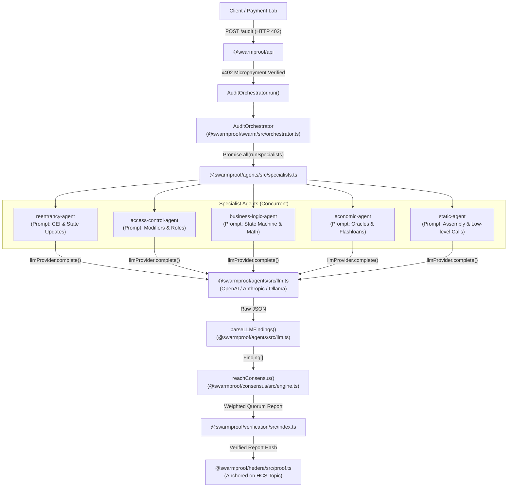

# 🤖 SwarmProof Agent Setup Guide & Code Architecture

This document provides a comprehensive guide for configuring real AI agents (OpenAI, Anthropic Claude, OpenRouter, Groq, DeepSeek, or local Ollama) in **SwarmProof**, along with an exact code reference map detailing how agents are instantiated, invoked, and coordinated across the consensus pipeline.

---

## 1. Architecture: The 5 Specialist AI Agents

SwarmProof distributes smart contract auditing across five specialized adversarial AI agents running in parallel. Rather than relying on fragile regex heuristics, each specialist agent operates with a dedicated domain system prompt and analyzes contracts independently:

| Specialist Agent | Domain & System Prompt Focus | Typical Vulnerabilities Detected |
| :--- | :--- | :--- |
| **`reentrancy-agent`** | Checks-Effects-Interactions (CEI), state transitions, token callback hooks | Classic reentrancy, cross-function reentrancy, read-only reentrancy, ERC-777/ERC-721 hooks |
| **`access-control-agent`** | Authorization, privilege boundaries, modifier validation | Missing `onlyOwner`/`onlyRole`, dangerous `tx.origin`, uninitialized proxies, unprotected initializers |
| **`business-logic-agent`** | State machines, accounting discrepancies, precision loss | Arithmetic rounding errors, division before multiplication, double-spending, token fee discrepancies |
| **`economic-agent`** | Financial mechanics, oracle dependencies, MEV | Spot price oracle manipulation, flash loan attack vectors, slippage omission, sandwich exploits |
| **`static-agent`** | EVM low-level call safety, compiler bugs | Unchecked `.call()` returns, arbitrary `delegatecall`, `selfdestruct`, assembly memory corruption |

---

## 2. LLM Provider Configuration (.env)

SwarmProof features a universal LLM provider layer (`@swarmproof/agents/src/llm.ts`). Add **one** of the following configurations to your root `.env` file:

### Option A: Anthropic Claude (Recommended for highest precision)
```bash
# Add to .env:
ANTHROPIC_API_KEY=sk-ant-api03-YOUR_KEY_HERE
ANTHROPIC_MODEL=claude-3-5-sonnet-20241022
# Optional base URL override (e.g. proxy or enterprise endpoint):
# ANTHROPIC_BASE_URL=https://api.anthropic.com/v1
```

### Option B: OpenAI Direct
```bash
# Add to .env:
OPENAI_API_KEY=sk-proj-YOUR_KEY_HERE
OPENAI_MODEL=gpt-4o-mini  # or gpt-4o
```

### Option C: OpenRouter / DeepSeek / Groq (OpenAI-Compatible APIs)
The `OpenAIProvider` works out-of-the-box with any OpenAI-compatible completions endpoint:

**OpenRouter (Any model: Claude, Llama, DeepSeek, Mistral):**
```bash
OPENAI_API_KEY=sk-or-v1-YOUR_OPENROUTER_KEY
OPENAI_BASE_URL=https://openrouter.ai/api/v1
OPENAI_MODEL=anthropic/claude-3.5-sonnet
```

**Groq (Ultra-low latency inference):**
```bash
OPENAI_API_KEY=gsk_YOUR_GROQ_KEY
OPENAI_BASE_URL=https://api.groq.com/openai/v1
OPENAI_MODEL=llama-3.3-70b-versatile
```

**DeepSeek Direct:**
```bash
OPENAI_API_KEY=sk-YOUR_DEEPSEEK_KEY
OPENAI_BASE_URL=https://api.deepseek.com/v1
OPENAI_MODEL=deepseek-chat
```

### Option D: Ollama (100% Local & Free, Zero Network API Calls)
Run a local LLM privately on your machine:
```bash
# 1. Pull your preferred coding model:
ollama run deepseek-coder-v2
# (or: ollama run codellama, ollama run qwen2.5-coder)

# 2. Add to .env:
OLLAMA_BASE_URL=http://localhost:11434
OLLAMA_MODEL=deepseek-coder-v2
```

---

## 3. Specialist Agent Payout Addresses (Hedera Account IDs)

Each agent has a cryptographic identity and receives micro-payments for participating in audits. You can configure custom Hedera account IDs for each agent in `.env`:

```bash
SWARMPROOF_AGENT_ADDRESSES={"reentrancy-agent":"0.0.10417474","access-control-agent":"0.0.10417474","business-logic-agent":"0.0.10417474","economic-agent":"0.0.10417474","static-agent":"0.0.10417474"}
```

---

## 4. Verification & Testing

### 1. Check API Health & Active LLM Mode
Run:
```bash
curl -s http://localhost:3001/health | jq
```
Response when an LLM is active:
```json
{
  "ok": true,
  "service": "swarmproof-api",
  "paymentMode": "x402",
  "hederaMode": "hedera",
  "paymentProofMode": "hedera",
  "identityMode": "hedera",
  "llmMode": "openai:gpt-4o-mini"
}
```
*(If no API key is provided, `llmMode` safely displays `"heuristic-fallback"`).*

### 2. Inspect the Live Agent Directory & W3C DIDs
Run:
```bash
curl -s http://localhost:3001/agents | jq
```
Each agent reports its active mode (`llm` vs `heuristic`), its canonical W3C DID (`did:hedera:testnet:<topicId>_<agentId>`), and links to its W3C DID Document & Verifiable Credential:
```json
{
  "agents": [
    {
      "agentId": "reentrancy-agent",
      "name": "Reentrancy Agent [openai:gpt-4o-mini]",
      "capabilities": ["reentrancy-detection", "cei-violation"],
      "mode": "llm",
      "provider": "openai:gpt-4o-mini",
      "identityReference": "0.0.10119346@1789018115.303791172",
      "identityTopicId": "0.0.10417469",
      "did": "did:hedera:testnet:0.0.10417469_reentrancy-agent",
      "w3cStandard": "did:hedera",
      "didDocumentUrl": "/agents/reentrancy-agent/did",
      "credentialUrl": "/agents/reentrancy-agent/credential"
    }
  ]
}
```

### 3. Query W3C DID Document & Verifiable Credential
Inspect the canonical W3C DID Core 1.0 JSON-LD document:
```bash
curl -s http://localhost:3001/agents/reentrancy-agent/did | jq
```

Inspect the W3C Verifiable Credential with cryptographic Hedera HCS consensus proof:
```bash
curl -s http://localhost:3001/agents/reentrancy-agent/credential | jq
```

Inspect the full registry of all active swarm DIDs:
```bash
curl -s http://localhost:3001/dids | jq
```

### 4. Run Automated Unit Tests
All 60 unit, identity, and end-to-end tests run offline in ~1.3 seconds:
```bash
pnpm test
```

---

## 5. Code Reference Map: Where & How Agents Get Called

Here is the exact code execution path showing how an audit request moves through the system:



### Exact Code File & Line References

1. **API Audit Trigger & x402 Payment**:
   - `@swarmproof/api/src/app.ts` (Lines 450–506) — Issues HTTP 402 challenge with x402 quote.
   - `@swarmproof/api/src/app.ts` (Lines 507–526) — Confirms payment on Hedera testnet and kicks off `runAudit(record)`.

2. **Specialist Instantiation & Environment Injection**:
   - `@swarmproof/api/src/app.ts` (Lines 81–91) — Calls `createLLMProviderFromEnv(env)` and configures `createSpecialistAgents({ addresses, llmProvider })`.
   - `@swarmproof/agents/src/llm.ts` (Lines 356–393) — Auto-detects Anthropic, OpenAI, or Ollama credentials.

3. **Orchestrator Concurrently Spawning Specialists**:
   - `@swarmproof/swarm/src/orchestrator.ts` (Lines 90–99) — Invokes `runSpecialists(this.deps.specialists, task)` with `Promise.all`.
   - `@swarmproof/agents/src/specialists.ts` (Lines 573–581) — Executes all 5 specialist agents in parallel.

4. **Specialist Domain Prompts & LLM Execution**:
   - `@swarmproof/agents/src/specialists.ts` (Lines 317–434) — Domain-specific system prompts defining strict JSON schema output.
   - `@swarmproof/agents/src/specialists.ts` (Lines 508–546) — `wrapAnalysis()` prepares contract context, dispatches to `llmProvider.complete()`, and gracefully falls back to deterministic AST/regex detectors if an LLM failure occurs.

5. **Universal LLM Providers (OpenAI, Anthropic, Ollama)**:
   - `@swarmproof/agents/src/llm.ts` (Lines 26–82) — `OpenAIProvider`: supports OpenAI, OpenRouter, Groq, and DeepSeek.
   - `@swarmproof/agents/src/llm.ts` (Lines 88–150) — `AnthropicProvider`: Claude 3.5 Sonnet / Haiku client.
   - `@swarmproof/agents/src/llm.ts` (Lines 156–207) — `OllamaProvider`: local self-hosted inference.

6. **Robust JSON Extraction & Finding Parsing**:
   - `@swarmproof/agents/src/llm.ts` (Lines 217–260) — `extractJsonFromLlmResponse()` parses direct JSON, markdown code blocks (` ```json `), and balanced brace boundaries.
   - `@swarmproof/agents/src/llm.ts` (Lines 285–343) — `parseLLMFindings()` normalizes LLM outputs into strictly typed `Finding` objects.

7. **Consensus, Clustering & Quorum Voting**:
   - `@swarmproof/swarm/src/orchestrator.ts` (Lines 100–109) — Clusters cross-agent findings and computes weighted quorum.
   - `@swarmproof/consensus/src/engine.ts` — Weighted voting algorithm ensuring only verified multi-agent findings reach the final report.

8. **Hedera HCS Proof Anchoring**:
   - `@swarmproof/swarm/src/orchestrator.ts` (Lines 120–140) — Computes deterministic report SHA-256 hash and anchors to Hedera Consensus Service Topic `0.0.10417469`.

---

## 6. Dynamic Agent Registration (W3C `did:hedera` & Verifiable Credentials)

SwarmProof allows dynamic onboarding of custom AI security specialist agents both via the Web UI and via the API. When an agent is registered, its decentralized identifier (`did:hedera:testnet:<topicId>_<agentId>`), W3C DID Core 1.0 Document, and `SwarmSecurityAuditorCredential` Verifiable Credential are generated and anchored on Hedera Consensus Service Topic `0.0.10417469`. It is immediately mounted into the swarm orchestrator's analysis engine, 3D visualizer, and x402 payment shares.

### Via Web Dashboard
1. Click **➕ Register Agent** in the top navigation bar or inside the 3D Swarm deck.
2. Select a quick-fill template (e.g. MEV & Flash Loan Sentinel, Bridge Guard, DAO Governance Guardian, Account Abstraction Auditor, ZK Circuit Verifier) or enter custom details.
3. Select a 3D orbit geometry (💎 Octahedron, 🛡️ Dodecahedron, ♾️ Torus Knot, 💠 Icosahedron, ⚙️ Gyroscope) and theme neon color.
4. Set the Hedera payout account ID (e.g. `0.0.10417474`) for receiving micro-payment shares.
5. Click **Register Agent on Hedera HCS →**.
6. The agent's W3C DID & VC are generated and anchored on Hedera testnet. You can copy the canonical W3C DID URI, click through to the HashScan explorer, inspect the raw JSON-LD DID Document, and review the W3C Verifiable Credential directly inside the modal!

### Via API Endpoint
```bash
curl -X POST http://localhost:3001/agents/register \
  -H "content-type: application/json" \
  -d '{
    "name": "MEV & Flash Loan Sentinel",
    "agentId": "mev-sentinel",
    "role": "Flash Loan Arbitrage & Slippage Protection",
    "capabilities": ["flash-loan", "oracle-manipulation", "sandwich-attacks"],
    "paymentAddress": "0.0.10417474",
    "shape": "icosahedron",
    "color": "#10b981",
    "model": "gpt-4o"
  }' | jq
```

Response payload includes the W3C DID, DID Document, and Verifiable Credential:
```json
{
  "ok": true,
  "agentId": "mev-sentinel",
  "name": "MEV & Flash Loan Sentinel",
  "did": "did:hedera:testnet:0.0.10417469_mev-sentinel",
  "w3cStandard": "did:hedera",
  "didDocument": {
    "@context": ["https://www.w3.org/ns/did/v1", "https://w3id.org/security/suites/ed25519-2020/v1"],
    "id": "did:hedera:testnet:0.0.10417469_mev-sentinel",
    "verificationMethod": [{
      "id": "did:hedera:testnet:0.0.10417469_mev-sentinel#key-1",
      "type": "Ed25519VerificationKey2020",
      "controller": "did:hedera:testnet:0.0.10417469_mev-sentinel",
      "blockchainAccountId": "hedera:testnet:0.0.10417474"
    }],
    "authentication": ["did:hedera:testnet:0.0.10417469_mev-sentinel#key-1"],
    "service": [{
      "id": "did:hedera:testnet:0.0.10417469_mev-sentinel#audit-service",
      "type": "SecurityAuditService",
      "serviceEndpoint": "http://localhost:3001/audit"
    }]
  },
  "verifiableCredential": {
    "@context": ["https://www.w3.org/2018/credentials/v1", "https://schema.org"],
    "id": "urn:uuid:credential-mev-sentinel",
    "type": ["VerifiableCredential", "SwarmSecurityAuditorCredential"],
    "issuer": "did:hedera:testnet:0.0.10417469_authority",
    "issuanceDate": "2026-09-10T06:31:30.510Z",
    "credentialSubject": {
      "id": "did:hedera:testnet:0.0.10417469_mev-sentinel",
      "name": "MEV & Flash Loan Sentinel",
      "role": "Flash Loan Arbitrage & Slippage Protection",
      "capabilities": ["flash-loan", "oracle-manipulation", "sandwich-attacks"],
      "paymentAddress": "0.0.10417474"
    },
    "proof": {
      "type": "HederaConsensusProof2026",
      "hcsTopicId": "0.0.10417469",
      "transactionId": "0.0.10119346@1789021885.521714338",
      "consensusTimestamp": "2026-09-10T06:31:30.510Z"
    }
  },
  "identityReference": "0.0.10119346@1789021885.521714338",
  "identityTopicId": "0.0.10417469",
  "consensusTimestamp": "2026-09-10T06:31:30.510Z"
}
```
